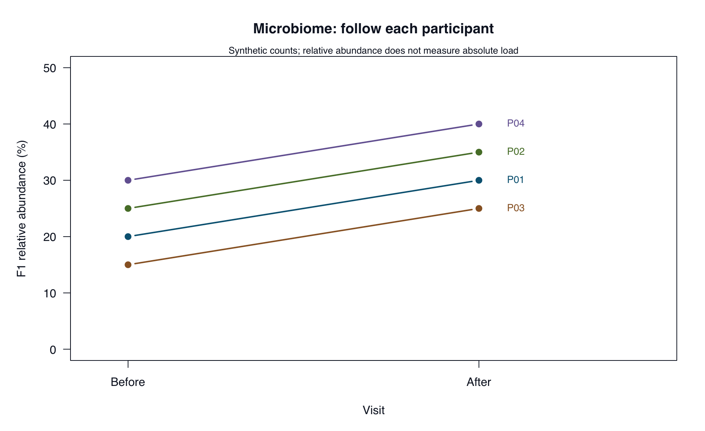

# Microbiome: methods, evidence, and claims {#sec-microbiome-case}

::: {.cdi-message}
- **ID:** ABE-004
- **Type:** Guided case study
- **Audience:** Researchers, learners, educators, and bioinformatics practitioners
- **Theme:** Microbial community evidence and defensible interpretation
:::

## The evaluation question

**Do the supplied data support the AI response’s claims about a change in the microbiome?**

You will review a synthetic study with four participants, each sampled before and after a dietary change. There is no untreated comparison group, absolute microbial-load measurement, or health outcome. All counts and taxonomic labels are invented teaching materials.

Your task is to verify descriptive results and identify the limits of the conclusions. This is a focused evaluation exercise, not a complete microbiome analysis pipeline.

## Inspect the evidence package

Read `cases/microbiome/README.md`, then inspect:

| File under `cases/microbiome/` | Role |
|---|---|
| `data/feature-counts.tsv` | Read counts for three features across eight samples |
| `data/sample-metadata.tsv` | Sample identity, participant identity, and visit |
| `data/taxonomy.tsv` | Fictional genus labels |
| `simulated-response.md` | Six claims to evaluate |
| `reference/` | Independently calculated expected tables |
| `worked-review.md` | Worked judgments and corrected interpretation |

The verification script is `scripts/R/04-verify-microbiome.R`. Keep original inputs unchanged. Metadata rows are intentionally arranged differently from count columns, so alignment must use identifiers.

## Make an initial judgment

Read the simulated response before opening the reference tables or worked review. It claims that the samples are independent, reports changes in F1, and concludes that the dietary change improved health.

Create `results/ch04/evidence-log.tsv` using the ABE-002 fields. Split statements that combine a valid calculation with an unsupported interpretation into separate findings.

For each claim, ask:

1. What evidence would establish it?
2. Can the supplied files answer the question?
3. What can I check directly, and what remains unresolved?

## Verify the descriptive results

From the repository root, run:

```bash
Rscript scripts/R/04-verify-microbiome.R
```

Alternatively, from an R session whose working directory is the repository root:

```r
source("scripts/R/04-verify-microbiome.R")
```

The script needs base R only. It validates identifiers and counts, aligns metadata, checks that each participant has one observation per visit, and calculates per-sample percentages and paired changes. It performs no significance test.

Inspect these files in `results/ch04/`:

- `sample-summary.tsv`: total reads, F1 reads, and F1 percentage by sample.
- `paired-changes.tsv`: before and after percentages for each participant.
- `input-checksums.tsv` and `session-info.txt`: input fingerprints and software details.

Outputs are overwritten on rerun. Preserve earlier outputs before experimenting. Compare numeric values and identifiers with the expected tables; harmless formatting differences do not imply different results.

::: {.callout-note title="Verification status"}
The supplied reference tables were independently calculated with Python from the input files. The R script has not been executed in the authoring environment. Record your own execution results; if a check fails, investigate it before accepting the expected answer.
:::

## Interpret what changed

Read counts and relative abundance answer different questions. A relative abundance is a feature’s share of the measured community; it does not establish its absolute quantity. See [Gloor et al. (2017)](https://doi.org/10.3389/fmicb.2017.02224) for the compositional nature of microbiome data.

Check the denominator used in every percentage. Also distinguish the number of samples from the number of participants: two visits from one participant do not create two independent participants.

::: {.callout-tip collapse="true" title="Worked interpretation"}
There are eight samples from four participants. Sample identifiers match, but row order differs.

Mean F1 read count rises from 22.5 to 65 while total reads per sample rise from 100 to 200. Mean F1 relative abundance rises from 22.5% to 32.5%: **10 percentage points**, or approximately **44.4% relative to the before mean**. Every participant has a 10-percentage-point increase.

These are descriptive results for synthetic data. They do not establish an absolute microbial increase, a causal dietary effect, statistical significance, or improved health. Consult `cases/microbiome/worked-review.md` for judgments on all six claims.
:::

## Deliverable and checkpoint

Write `results/ch04/evaluation-report.md` with the question, checks performed, prioritized findings, corrected conclusion, and remaining limitations. Link to your evidence log and output files.

Before continuing, confirm that you preserved supported results, accounted for paired observations, used the correct percentage language, and removed claims requiring evidence that is absent.

## Read the visual evidence

{#fig-abe-04 fig-alt="Paired F1 relative abundances rise by 10 percentage points for each participant. These sequencing proportions do not establish absolute microbial changes." width=100%}

Each line represents one participant measured before and after.

::: {.callout-note collapse="true" title="Recreate the figures"}
Run from the repository root:

```bash
Rscript scripts/R/plot-evaluation-cases.R
```

[View or download the base-R plotting code](scripts/R/plot-evaluation-cases.R). It reads the supplied case data and regenerates all five figures in `results/figures/`. Existing images are overwritten; book rendering does not run this script.

The bundled PNGs were generated with the [Python plotting code](scripts/python/plot-evaluation-cases.py). The R alternative uses the same inputs and calculations but has not been executed in the authoring environment. Layout may differ slightly.
:::

Continue to the [RNA-seq Case](05-rnaseq-case.qmd), where you will apply the framework with less guidance.
