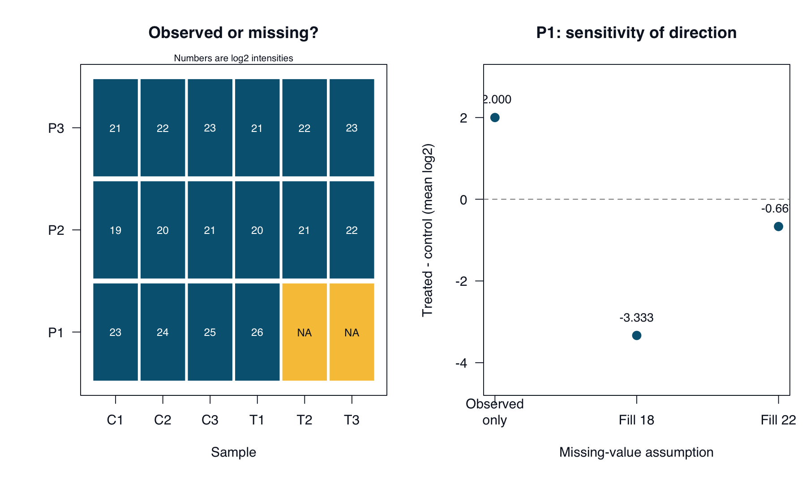

# Proteomics: missing values and interpretation {#sec-proteomics-case}

::: {.cdi-message}
- **ID:** ABE-007
- **Type:** Case evaluation
- **Audience:** Researchers, learners, educators, and bioinformatics practitioners
- **Theme:** Missing measurements and sensitivity to imputation
:::

## Your evaluation brief

**Does an apparent protein increase survive a change in missing-value assumptions?** This original synthetic case contains six independent biological samples, three per condition, and three fictional protein groups. Values are supplied log2 intensities; `NA` means not quantified. No raw spectra, peptide evidence, normalization record, or statistical analysis is provided.

Read `cases/proteomics/README.md` and `cases/proteomics/simulated-response.md`. The data folder contains `sample-metadata.tsv` and `log2-intensities.tsv`. Protein groups are teaching identifiers, not validated biological entities.

## Plan your review

Create `results/ch07/evidence-log.tsv`. Evaluate each of the six claims before opening the worked review. Identify the biological replicates, count missing measurements by condition, and distinguish an observed difference from an assumption-dependent result.

Imputation depends on assumptions about why values are missing; a missing measurement does not identify its own mechanism [@abe-lazar2016]. Here, replacing missing values with 18 or 22 is a deliberately simplified sensitivity exercise, not a recommended analysis method.

## Verify selected properties

Run from the repository root:

```bash
Rscript scripts/R/07-verify-proteomics.R
```

The base-R script checks identifiers and numeric inputs, then writes:

| Output in `results/ch07/` | Purpose |
|---|---|
| `missingness.tsv` | Count observed and missing values per protein and condition. |
| `sensitivity.tsv` | Compare observed-only means with two fixed-value replacements. |
| `input-checksums.tsv`, `session-info.txt` | Record input fingerprints and software details. |

The reported difference is mean log2 intensity in treated samples minus mean log2 intensity in controls. Its exponent, `2^difference`, is a ratio of geometric means on the original scale, not a ratio of arithmetic means. Observed-only summaries may use different numbers of samples and do not remove missing-data bias.

The script overwrites its named outputs. It performs no normalization, differential-abundance test, or protein-identification validation.

## Write your evaluation

Save a concise report to `results/ch07/evaluation-report.md`. Retain valid arithmetic, identify conclusions that depend on replacement values, and request the evidence needed to assess normalization, identification, and uncertainty. Do not substitute an arbitrary replacement rule for a justified missing-data strategy.

::: {.callout-tip collapse="true" title="Self-check after your initial review"}
P1 has three observed controls and one observed treated value. Its treated-minus-control difference is 2 using observed values, approximately -3.333 when missing values are replaced with 18, and -0.667 when replaced with 22. These correspond to geometric-mean ratios of 4, approximately 0.099, and approximately 0.630.

P2 has complete measurements and a descriptive difference of 1; P3 has complete measurements and a difference of 0. Neither supplies a significance test. Compare your six judgments with `cases/proteomics/worked-review.md`.
:::

Reference tables were calculated independently with Python. The R script has not been executed in the authoring environment; compare your run with `cases/proteomics/reference/` and record discrepancies.

## Read the visual evidence

{#fig-abe-07 fig-alt="P1 has two missing treated measurements. Its descriptive log2 difference changes from 2 with observed values to approximately -3.333 or -0.667 under the two replacement assumptions." width=100%}

Teal cells are observed log2 intensities; yellow cells are missing. Replacement values illustrate sensitivity and are not recommended imputation methods.

::: {.callout-note collapse="true" title="Recreate the figures"}
Run from the repository root:

```bash
Rscript scripts/R/plot-evaluation-cases.R
```

[View or download the base-R plotting code](scripts/R/plot-evaluation-cases.R). It reads the supplied case data and regenerates all five figures in `results/figures/`. Existing images are overwritten; book rendering does not run this script.

The bundled PNGs were generated with the [Python plotting code](scripts/python/plot-evaluation-cases.py). The R alternative uses the same inputs and calculations but has not been executed in the authoring environment. Layout may differ slightly.
:::

Continue to [GWAS](08-gwas-case.qmd) to examine population structure and association claims.
