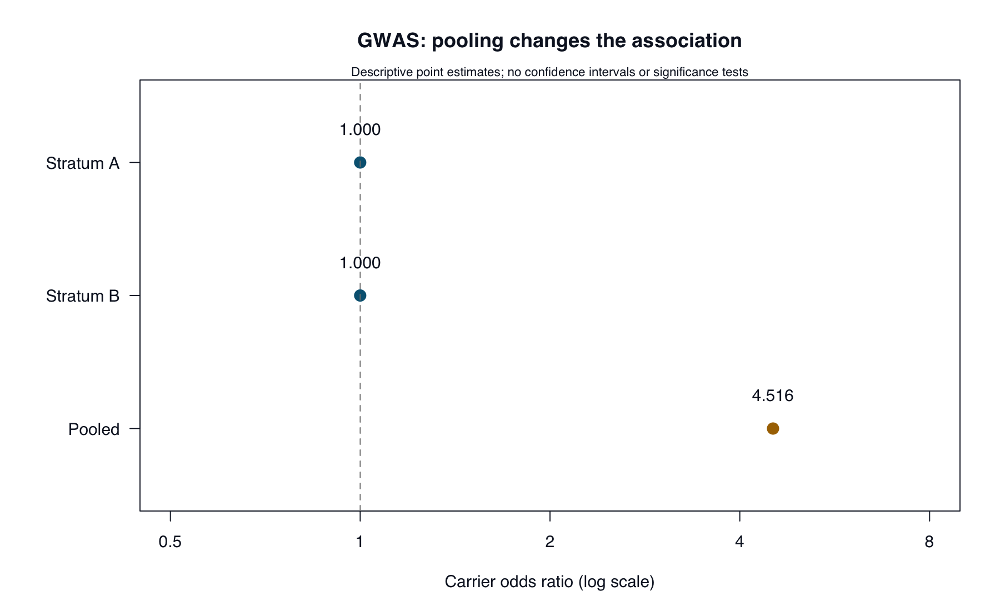

# GWAS: population structure and association {#sec-gwas-case}

::: {.cdi-message}
- **ID:** ABE-008
- **Type:** Case evaluation
- **Audience:** Researchers, learners, educators, and bioinformatics practitioners
- **Theme:** Pooled associations and within-group evidence
:::

## Your evaluation brief

**Does a pooled association establish a variant effect when group composition differs between cases and controls?** This original synthetic example supplies carrier counts for one fictional autosomal variant in two fictional genetic-background strata, A and B. The strata are teaching labels, not demographic or racial categories.

Read `cases/gwas/README.md` and `cases/gwas/simulated-response.md`. The table `cases/gwas/data/carrier-counts.tsv` summarizes 400 distinct unrelated participants. A carrier has at least one copy of the designated allele. Counts are people, not alleles; this is a carrier-based comparison, not an additive dosage GWAS.

## Plan your review

Create `results/ch08/evidence-log.tsv` and evaluate each of the six claims. Check totals, compare group composition, and calculate carrier odds ratios within each stratum before pooling.

Population structure can confound genetic associations; appropriate analyses assess and account for it [@abe-price2006]. This case uses known strata to illustrate the problem. It does not calculate principal components or implement a full GWAS correction.

## Verify selected properties

```bash
Rscript scripts/R/08-verify-gwas.R
```

Run from the repository root. The base-R script validates the count table and writes:

| Output in `results/ch08/` | Purpose |
|---|---|
| `association-checks.tsv` | Compare carrier proportions and odds ratios within strata and pooled. |
| `composition.tsv` | Check the proportion from each stratum among cases and controls. |
| `input-checksums.tsv`, `session-info.txt` | Record inputs and software details. |

For each comparison, calculate `(case carriers × control noncarriers) / (case noncarriers × control carriers)`. Odds ratios are not risk ratios. All cells are positive in this exercise; the script stops on zero cells rather than silently choosing a correction.

Outputs are overwritten on rerun. The script produces no p-values, confidence intervals, ancestry estimates, or adjusted genome-wide analysis.

## Write your evaluation

Save `results/ch08/evaluation-report.md`. Explain why pooled and within-stratum results differ and what can be concluded from this table. Identify the missing evidence needed to evaluate a real GWAS: genotype and sample QC, relatedness, population structure, the association model, multiple-testing control, and replication.

Genome-wide significance cannot be established from a single descriptive table. A marker association alone also does not identify a causal variant or causal gene; linked variants and functional evidence require further investigation.

::: {.callout-tip collapse="true" title="Self-check after your initial review"}
There are 200 cases and 200 controls. Within A, carrier proportions are 80% for both; within B, they are 20% for both. Each within-stratum odds ratio is 1. Pooled proportions are 68% and 32%, producing an odds ratio of 4.515625.

Cases are 80% stratum A, whereas controls are 20% stratum A. The pooled association reflects the different group mixtures in this constructed example. The within-stratum point estimates do not establish equivalence or exclude small effects in a population.

Compare your judgments with `cases/gwas/worked-review.md`.
:::

Reference values were calculated independently with Python. The R script has not been executed in the authoring environment. Record your actual run and compare it with `cases/gwas/reference/`.

## Read the visual evidence

{#fig-abe-08 fig-alt="Carrier odds ratios are 1 within each stratum and approximately 4.52 when pooled. The pooled association reflects unequal stratum composition in this synthetic example." width=100%}

Points are descriptive estimates on a logarithmic axis. No confidence intervals, significance tests, or causal conclusions are supplied.

::: {.callout-note collapse="true" title="Recreate the figures"}
Run from the repository root:

```bash
Rscript scripts/R/plot-evaluation-cases.R
```

[View or download the base-R plotting code](scripts/R/plot-evaluation-cases.R). It reads the supplied case data and regenerates all five figures in `results/figures/`. Existing images are overwritten; book rendering does not run this script.

The bundled PNGs were generated with the [Python plotting code](scripts/python/plot-evaluation-cases.py). The R alternative uses the same inputs and calculations but has not been executed in the authoring environment. Layout may differ slightly.
:::

Continue to [Independent Evaluation](09-independent-evaluation.qmd) to bring the review process together.
